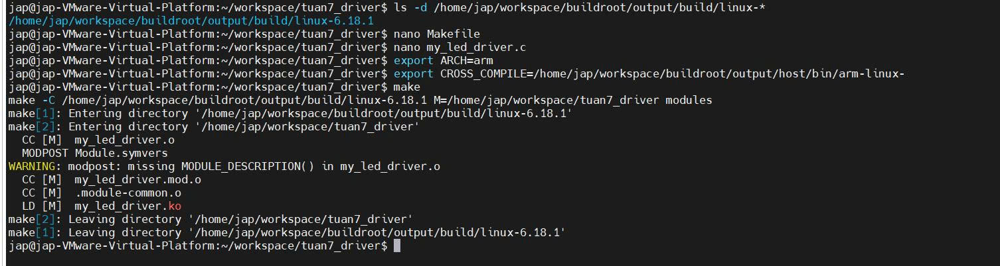

TUẦN 7 - DEVICE DRIVER ĐIỀU KHIỂN LED - NHÓM 9
----------------------------

* * * * *

1\. MỤC TIÊU
------------

-   Xây dựng device driver trong Linux để điều khiển LED.

-   Hiểu cơ chế giao tiếp giữa **Kernel Space** và **User Space**.

-   Thực hiện điều khiển LED thông qua file thiết bị `/dev`.

* * * * *
Demo kết quả:https://drive.google.com/file/d/1PE1RKdCOp1bQzUKxcOQa8eXQJv-8DFle/view?usp=sharing

2\. MÔI TRƯỜNG THỰC HIỆN
------------------------

-   Máy ảo Ubuntu

-   Buildroot toolchain

-   Board: BeagleBone Black

-   Kết nối: MobaXterm

* * * * *
PHẦN 1: THỰC HIỆN TRÊN MÁY ẢO UBUNTU
=======================================

* * * * *

2.1. Chuẩn bị thư mục và mã nguồn Driver
----------------------------------------

Thực hiện các lệnh sau:

```
mkdir -p ~/workspace/tuan7_driver
cd ~/workspace/tuan7_driver
nano my_led_driver.c

```

Dán mã nguồn sau vào file `my_led_driver.c`:

```
#include <linux/module.h>
#include <linux/fs.h>
#include <linux/device.h>
#include <linux/uaccess.h>
#include <linux/io.h>

#define DEVICE_NAME "my_led_device"
#define CLASS_NAME  "led_class"

#define GPIO1_BASE 0x4804C000
#define GPIO1_SIZE 0x1000
#define GPIO_OE 0x134
#define GPIO_DATAOUT 0x13C
#define GPIO_SETDATAOUT 0x194
#define GPIO_CLEARDATAOUT 0x190
#define LED_USR3 (1 << 24)

static int majorNumber;
static struct class* ledClass  = NULL;
static struct device* ledDevice = NULL;
static void __iomem *gpio1_addr;

static int dev_open(struct inode *inodep, struct file *filep){
   return 0;
}

static ssize_t dev_write(struct file *filep, const char *buffer, size_t len, loff_t *offset){
   char message[10] = {0};
   if(len > 9) len = 9;
   if(copy_from_user(message, buffer, len)) return -EFAULT;

   if (message[0] == '1') {
       iowrite32(LED_USR3, gpio1_addr + GPIO_SETDATAOUT);
       printk(KERN_INFO "MyDriver: LED USR3 ON\n");
   } else if (message[0] == '0') {
       iowrite32(LED_USR3, gpio1_addr + GPIO_CLEARDATAOUT);
       printk(KERN_INFO "MyDriver: LED USR3 OFF\n");
   }
   return len;
}

static ssize_t dev_read(struct file *filep, char *buffer, size_t len, loff_t *offset){
   char status[20];
   int status_len;
   uint32_t reg_val = ioread32(gpio1_addr + GPIO_DATAOUT);
   if (reg_val & LED_USR3) status_len = sprintf(status, "LED is ON\n");
   else status_len = sprintf(status, "LED is OFF\n");

   if (*offset > 0) return 0;
   if(copy_to_user(buffer, status, status_len)) return -EFAULT;
   *offset = status_len;
   return status_len;
}

static int dev_release(struct inode *inodep, struct file *filep){
   return 0;
}

static struct file_operations fops = {
   .owner = THIS_MODULE,
   .open = dev_open,
   .read = dev_read,
   .write = dev_write,
   .release = dev_release,
};

static int __init led_init(void){
   majorNumber = register_chrdev(0, DEVICE_NAME, &fops);
   ledClass = class_create(CLASS_NAME);
   ledDevice = device_create(ledClass, NULL, MKDEV(majorNumber, 0), NULL, DEVICE_NAME);
   gpio1_addr = ioremap(GPIO1_BASE, GPIO1_SIZE);

   uint32_t reg = ioread32(gpio1_addr + GPIO_OE);
   reg &= ~LED_USR3;
   iowrite32(reg, gpio1_addr + GPIO_OE);

   printk(KERN_INFO "MyDriver: Init thanh cong!\n");
   return 0;
}

static void __exit led_exit(void){
   iounmap(gpio1_addr);
   device_destroy(ledClass, MKDEV(majorNumber, 0));
   class_destroy(ledClass);
   unregister_chrdev(majorNumber, DEVICE_NAME);
}

module_init(led_init);
module_exit(led_exit);
MODULE_LICENSE("GPL");

```

* * * * *

2.2. Tạo Makefile
-----------------

```
nano Makefile

```

Nội dung:

```
obj-m += my_led_driver.o
KDIR := /home/jap/workspace/buildroot/output/build/linux-6.18.1
all:
	make -C $(KDIR) M=$(PWD) modules
clean:
	make -C $(KDIR) M=$(PWD) clean

```

* * * * *

2.3. Biên dịch Driver
---------------------

```
export ARCH=arm
export CROSS_COMPILE=/home/jap/workspace/buildroot/output/host/bin/arm-linux-
make clean
make

```

* * * * *

2.4. Tạo và biên dịch chương trình User Space
---------------------------------------------

Tạo file:

```
nano test_led.c

```

Nội dung:

```
#include <stdio.h>
#include <fcntl.h>
#include <unistd.h>

int main() {
    int fd = open("/dev/my_led_device", O_RDWR);
    if (fd < 0) {
        printf("Loi: Khong mo duoc device file!\n");
        return 1;
    }
    printf("--- BAT DAU BLINK LED (TAN SO THAY DOI) ---\n");
    for(int loop = 0; loop < 3; loop++) {
        printf("Dang nhay NHANH (0.2s)...\n");
        for(int i = 0; i < 10; i++) {
            write(fd, "1", 1); usleep(200000);
            write(fd, "0", 1); usleep(200000);
        }
        printf("Dang nhay CHAM (1.0s)...\n");
        for(int i = 0; i < 3; i++) {
            write(fd, "1", 1); sleep(1);
            write(fd, "0", 1); sleep(1);
        }
    }
    printf("--- KET THUC BAI TAP ---\n");
    close(fd);
    return 0;
}

```

Biên dịch:

```
export CC=/home/jap/workspace/buildroot/output/host/bin/arm-linux-gcc
$CC test_led.c -o test_led

```

* * * * *

PHẦN 2: COPY FILE VÀO THẺ NHỚ
================================

-   Cắm thẻ nhớ vào Ubuntu

-   Mở phân vùng rootfs (~512MB)

-   Copy:

    -   `my_led_driver.ko`

    -   `test_led`

-   Dán vào thư mục:

```
/root

```

-   Eject an toàn

* * * * *

PHẦN 3: THỰC THI TRÊN BEAGLEBONE BLACK
=========================================

* * * * *

3.1. Chuẩn bị hệ thống
----------------------

```
/etc/init.d/S99blink stop
echo none > /sys/class/leds/beaglebone:green:usr3/trigger
rmmod my_led_driver 2>/dev/null

```

* * * * *

3.2. Nạp Driver và kiểm tra
---------------------------

```
cd /root
insmod my_led_driver.ko
dmesg | tail

```

Kiểm tra xuất hiện:

```
MyDriver: Init thanh cong!

```

Cấp quyền:

```
chmod 666 /dev/my_led_device

```

* * * * *

3.3. Kiểm tra Read/Write
------------------------

```
echo 1 > /dev/my_led_device
cat /dev/my_led_device

```

Kết quả:

```
LED is ON

```

```
echo 0 > /dev/my_led_device
cat /dev/my_led_device

```

Kết quả:

```
LED is OFF

```

* * * * *

3.4. Chạy chương trình Blink LED
--------------------------------

```
chmod +x test_led
./test_led

```

* * * * *

4. KẾT LUẬN
==============

-   Đã xây dựng thành công device driver điều khiển LED.

-   Thực hiện được giao tiếp giữa kernel và user space.

-   LED có thể bật/tắt và nhấp nháy thông qua chương trình người dùng.
